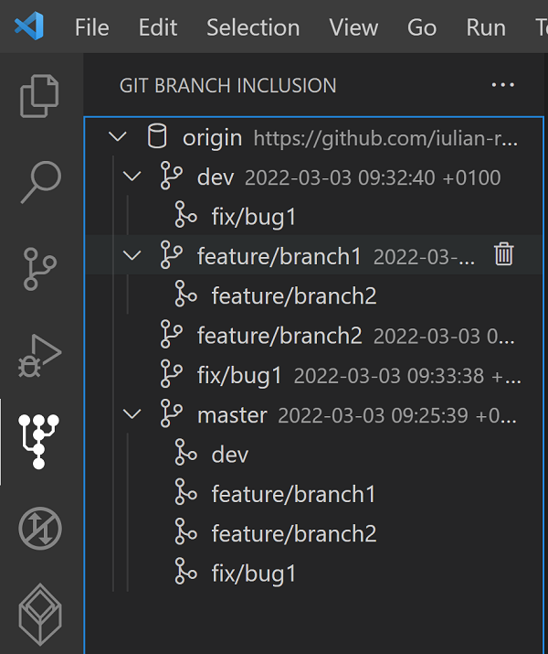

# Merged Git Branches

Automatically find all remote Git branches and displays in which other branches are they merged.

## Features

- Automatically find all remote Git branches and displays in which other branches are they merged
- For merged branches, a command to remove the remote Git branch can be displayed inside of a Visual Studio Code terminals
- The possibility to copy the branch's name

## Usage

This extension has its own panel. The symbol of this panel is an icon displaying Git branches going up.

Open the panel and the extension will start the scan for all remote branches.
If you make changes in the Git repository, the extension will not detect these to avoid unnecessary scans.
You can force a rescan using the reload button found at top right of the panel.

If there are no repositories or remote branches, the panel will display this information.

### Screenshot

Bellow you can see an example of found remote branches as are they displayed by this extension:

## Requirements

There are no special requirements.

## Extension Settings

- mergedGitBranches.debug:

  - Merged Git Branches: log all errors in an output window
  - default false

- mergedGitBranches.defaultResultExpanded:

  - Merged Git Branches: show all found results initially expanded (otherwise collapsed)
  - default false

## Known Issues

None.

## Change Log

See Change Log [here](CHANGELOG.md)

## Issues

Submit an [issue](https://github.com/iulian-radu-at/merged-git-branches/issues) if you find any bug or have any request.

## Contribution

Fork the [repo](https://github.com/iulian-radu-at/merged-git-branches) and submit pull requests.
